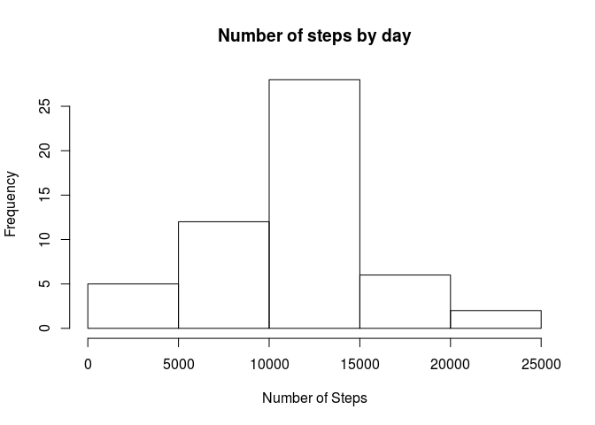
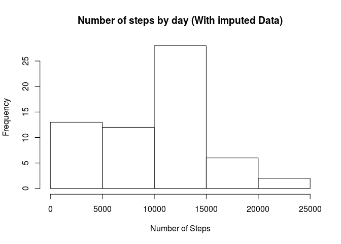
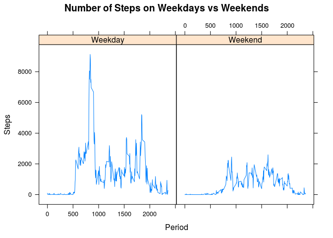
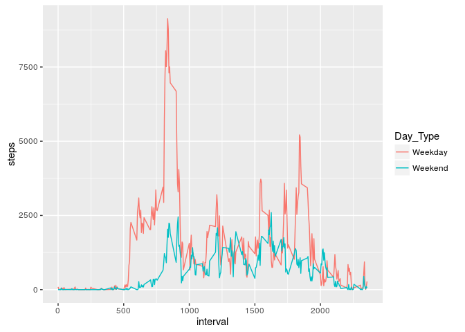

# Reproducible Research: Peer Assessment 1


## Introduction

It is now possible to collect a large amount of data about personal movement using activity monitoring devices such as a *Fitbit, Nike Fuelband*, or *Jawbone Up*. These type of devices are part of the **quantified self** movement – a group of enthusiasts who take measurements about themselves regularly to improve their health, to find patterns in their behavior, or because they are tech geeks. But these data remain under-utilized both because the raw data are hard to obtain and there is a lack of statistical methods and software for processing and interpreting the data.

This device collects data at 5 minute intervals through out the day. This report is based on two months of data from an anonymous individual collected during the months of October and November, 2012 and include the number of steps taken in 5 minute intervals each day.

## Loading and preprocessing the data

```r
# reading compressed dataset
activity.raw <- data.table::as.data.table(read.csv(unzip('activity.zip')))

# removing NA values
activity <- na.omit(activity.raw)
```

## Descriptive Statistics for the number of steps by day

The following histogram describes the number of steps taken in any given day:

```r
daily <- activity[,.(steps=sum(steps)),by=.(date)] 
hist(daily$steps, main = 'Number of steps by day', xlab = 'Number of Steps')
```

<!-- -->

A basic statistical summary of the of the number of steps grouped by day follows:

```r
summary(daily$steps)
```

```
##    Min. 1st Qu.  Median    Mean 3rd Qu.    Max. 
##      41    8841   10760   10770   13290   21190
```

Which gives us an average of around 10,800 steps per day.

# Time series for number of steps
When considering the evolution over time of the number of steps by the user we obtain the following plot:

```r
daily.ts <- xts::xts(daily$steps, order.by=as.POSIXct(daily$date))
names(daily.ts) <- 'Steps'
dygraphs::dygraph(daily.ts, main = 'Daily Steps')
```

<!--html_preserve--><div id="htmlwidget-b04913fe5090c9ee1a36" style="width:672px;height:480px;" class="dygraphs html-widget"></div>
<script type="application/json" data-for="htmlwidget-b04913fe5090c9ee1a36">{"x":{"attrs":{"title":"Daily Steps","labels":["day","Steps"],"legend":"auto","retainDateWindow":false,"axes":{"x":{"pixelsPerLabel":60}}},"scale":"daily","annotations":[],"shadings":[],"events":[],"format":"date","data":[["2012-10-01T22:00:00.000Z","2012-10-02T22:00:00.000Z","2012-10-03T22:00:00.000Z","2012-10-04T22:00:00.000Z","2012-10-05T22:00:00.000Z","2012-10-06T22:00:00.000Z","2012-10-08T22:00:00.000Z","2012-10-09T22:00:00.000Z","2012-10-10T22:00:00.000Z","2012-10-11T22:00:00.000Z","2012-10-12T22:00:00.000Z","2012-10-13T22:00:00.000Z","2012-10-14T22:00:00.000Z","2012-10-15T22:00:00.000Z","2012-10-16T22:00:00.000Z","2012-10-17T22:00:00.000Z","2012-10-18T22:00:00.000Z","2012-10-19T22:00:00.000Z","2012-10-20T22:00:00.000Z","2012-10-21T22:00:00.000Z","2012-10-22T22:00:00.000Z","2012-10-23T22:00:00.000Z","2012-10-24T22:00:00.000Z","2012-10-25T22:00:00.000Z","2012-10-26T22:00:00.000Z","2012-10-27T22:00:00.000Z","2012-10-28T23:00:00.000Z","2012-10-29T23:00:00.000Z","2012-10-30T23:00:00.000Z","2012-11-01T23:00:00.000Z","2012-11-02T23:00:00.000Z","2012-11-04T23:00:00.000Z","2012-11-05T23:00:00.000Z","2012-11-06T23:00:00.000Z","2012-11-07T23:00:00.000Z","2012-11-10T23:00:00.000Z","2012-11-11T23:00:00.000Z","2012-11-12T23:00:00.000Z","2012-11-14T23:00:00.000Z","2012-11-15T23:00:00.000Z","2012-11-16T23:00:00.000Z","2012-11-17T23:00:00.000Z","2012-11-18T23:00:00.000Z","2012-11-19T23:00:00.000Z","2012-11-20T23:00:00.000Z","2012-11-21T23:00:00.000Z","2012-11-22T23:00:00.000Z","2012-11-23T23:00:00.000Z","2012-11-24T23:00:00.000Z","2012-11-25T23:00:00.000Z","2012-11-26T23:00:00.000Z","2012-11-27T23:00:00.000Z","2012-11-28T23:00:00.000Z"],[126,11352,12116,13294,15420,11015,12811,9900,10304,17382,12426,15098,10139,15084,13452,10056,11829,10395,8821,13460,8918,8355,2492,6778,10119,11458,5018,9819,15414,10600,10571,10439,8334,12883,3219,12608,10765,7336,41,5441,14339,15110,8841,4472,12787,20427,21194,14478,11834,11162,13646,10183,7047]]},"evals":[],"jsHooks":[]}</script><!--/html_preserve-->

## Interval Analysis
The 5-minute intervals that, on average, contain the highest number of steps are listed in order:

```r
fivemin <- activity[,.(avg.steps=mean(steps)), by=.(interval)] 
fivemin.ord <- fivemin[order(-avg.steps)]
head(fivemin.ord)
```

```
##    interval avg.steps
## 1:      835  206.1698
## 2:      840  195.9245
## 3:      850  183.3962
## 4:      845  179.5660
## 5:      830  177.3019
## 6:      820  171.1509
```
The intervals with the highest number of steps cluster around the higuest at interval 835.

## Imputing missing values
The dataset contains nonetheless numerous missing values in the step column that we can input using a [predictive mean matching algorithm](http://statisticalhorizons.com/predictive-mean-matching).


```r
suppressMessages(library(mice))
suppressWarnings(activity.comp <- data.table::as.data.table(complete(mice(activity.raw, printFlag = FALSE))))
```
If now we plot the histogram for the daily number of steps witht he imputed data we have:

```r
daily.comp <- activity.comp[,.(steps=sum(steps)),by=.(date)] 
hist(daily.comp$steps, main = 'Number of steps by day (With imputed Data)', xlab = 'Number of Steps')
```

<!-- -->

## Weekdays vs Weekends

The following panel plot compares  the average number of steps taken per 5-minute interval across weekdays and weekends:

```r
activity.comp <- activity.comp[,day := weekdays(as.Date(date))]
activity.comp <- activity.comp[,Day_Type := ifelse(day %in% c('Saturday','Sunday'),'Weekend','Weekday')]
activity.wk <- activity.comp[,.(steps=sum(steps)),by=.(Day_Type, interval)]

library(lattice)
xyplot(steps ~ interval | Day_Type, 
       data =  activity.wk,
       type = 'l',
  	main="Number of Steps on Weekdays vs Weekends", 
   ylab="Steps", xlab="Period")
```

<!-- -->

```r
library(ggplot2)
ggplot(activity.wk,aes(x=interval,y=steps,colour=Day_Type,group=Day_Type)) + geom_line()
```

<!-- -->
